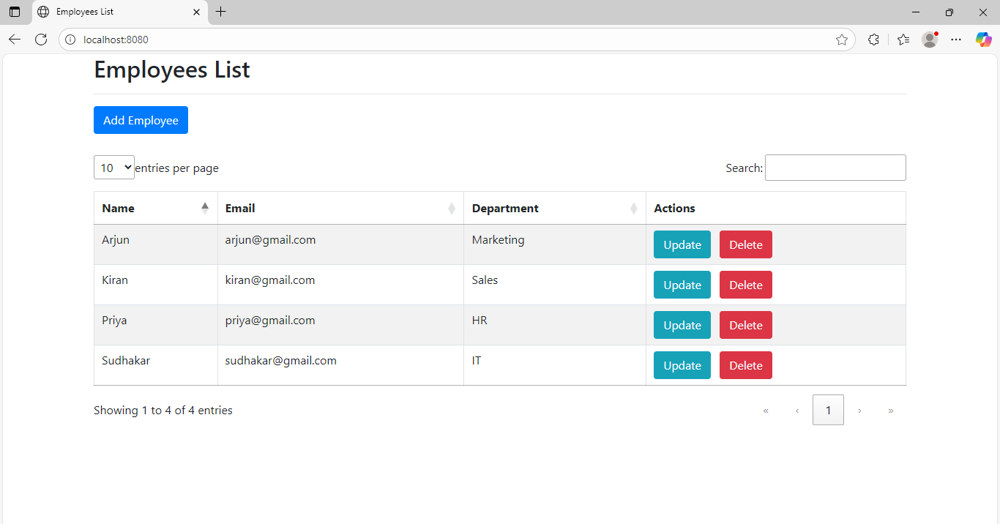
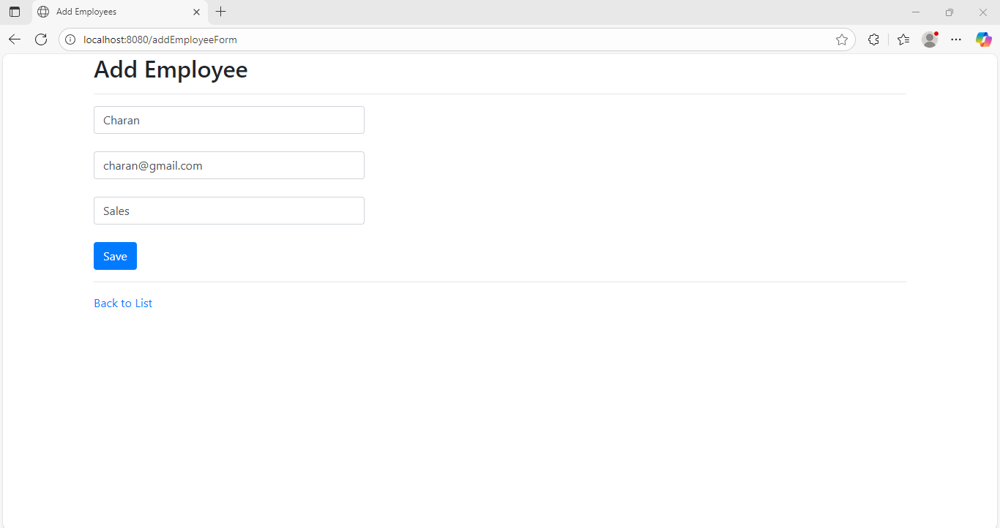
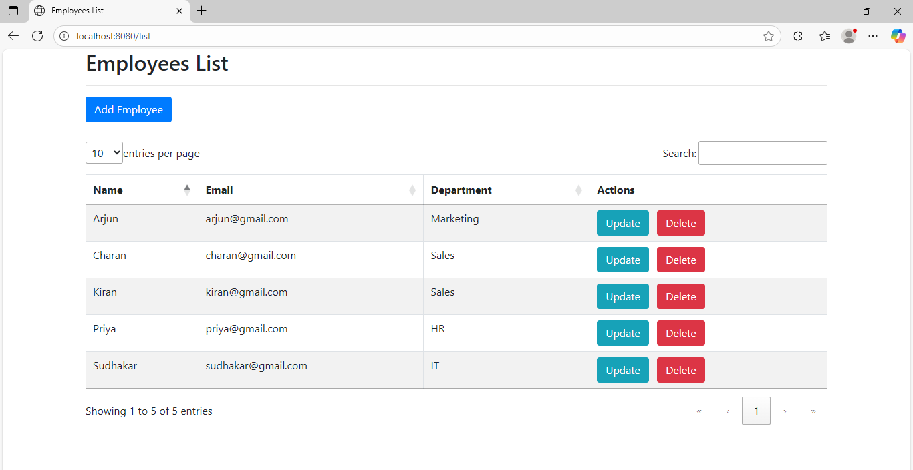
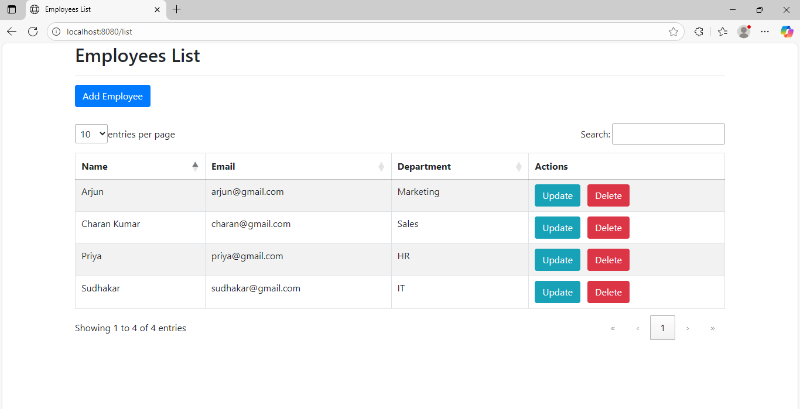

# 🧑‍💼 Employee Management System

A simple **Spring Boot CRUD web application** for managing employees built using **Thymeleaf**, **MySQL**, and **Spring Data JPA**.

---

## 🚀 Features

- ✅ View list of all employees
- ✅ Add new employee
- ✅ Save to MySQL database
- ✅ Thymeleaf-powered UI with Bootstrap 4
  

---

## 🛠️ Tech Stack

| Layer          | Technology         |
|----------------|--------------------|
| Language       | Java 17            |
| Framework      | Spring Boot 3.5    |
| ORM            | Spring Data JPA    |
| View Layer     | Thymeleaf          |
| Database       | MySQL              |
| Styling        | Bootstrap 4        |
| Build Tool     | Maven              |
| IDE            | Eclipse IDE        |

---

## 💻 Running the Application

### 1️⃣ Clone the Repository

```bash
git clone https://github.com/<your-username>/employee-management-system.git
cd employee-management-system
```
### 2️⃣ Configure the Database
Update your `src/main/resources/application.properties` file:

```properties
spring.datasource.url=jdbc:mysql://localhost:3306/emp
spring.datasource.username=root
spring.datasource.password=YourMySQLPassword
spring.jpa.hibernate.ddl-auto=update
```
Make sure a database named emp exists in MySQL.

### 3️⃣ Run the App
In Eclipse → Run EmployeeManagementSystemApplication.java as a Spring Boot App

### 📂 Project Structure

```text
EmployeeManagementSystem/
├── pom.xml
├── README.md
├── application.properties          ← optional (usually in resources)
├── screenshots/                    ← contains UI images
│   ├── add-employee-form.png
│   ├── home-page.png
│   └── delete-success.png
└── src/
    └── main/
        ├── java/
        │   └── com/
        │       └── employee/
        │           ├── controller/
        │           │   └── EmployeeController.java
        │           ├── entity/
        │           │   └── Employee.java
        │           ├── repository/
        │           │   └── IEmployeeRepository.java
        │           └── demo/
        │               └── EmployeeManagementSystemApplication.java
        └── resources/
            ├── templates/
            │   ├── employeeslist.html
            │   └── addEmployeeForm.html
            └── application.properties

```
### 📸 Screenshots

### 1.Home Page




### 2.Add Employee Form




### 3.After Updating List




### 4.After Deleting Employee


